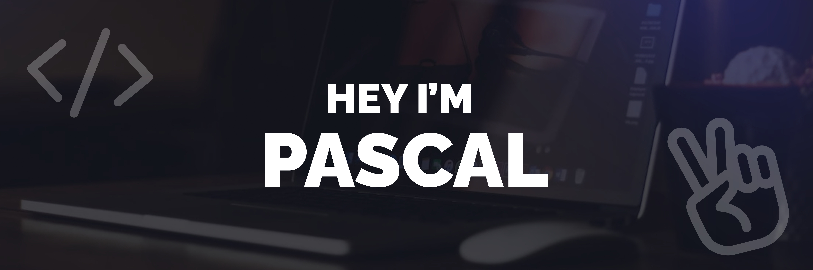

### Hey there 👋  
I'm Pascal, a passionate web developer. My days are filled with crafting beautiful websites, where I merge my love for design and functionality. I consistently embrace new learning opportunities and am always eager to acquire fresh skills. My expertise primarily revolves around utilizing JavaScript and TypeScript, enabling me to construct full-fledged websites with seamless front-end and back-end functionality. Alongside my unwavering commitment to quality, my aim is to turn each project into an engaging and successful experience.

Want to know more about me? [Check out my portfolio](https://dotwood.media/portfolio).

# 😎┆Frontend Skills

# 💻┆Backend Skills

# 🔥┆Github streak

# 🚀┆Github stats

# 📫┆Let's Connect

- GitHub: [@DotwoodMedia](https://github.com/DotwoodMedia)
- LinkedIn: [Pascal van Stiphout](https://www.linkedin.com/in/pascal-van-stiphout)
- Facebook: [DotwoodMedia](https://www.facebook.com/DotwoodMedia)
- Instagram: [@Dotwood.media](https://www.instagram.com/Dotwood.media)
- Twitter: [@DotwoodMedia](https://twitter.com/DotwoodMedia)
- Website: [dotwood.media](https://dotwood.media/)

Feel free to connect with me on these platforms! Whether you're interested in coding, design, or just want to share a virtual high-five, I'm always up for a chat. 🤝🚀

-----
Last Edited on: 6 August 2023
